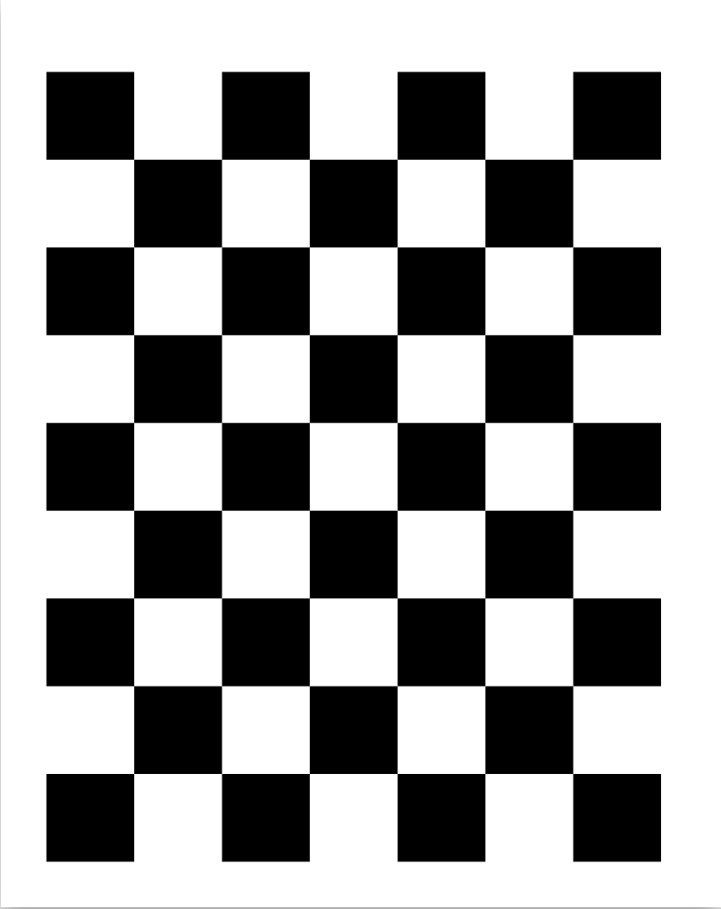
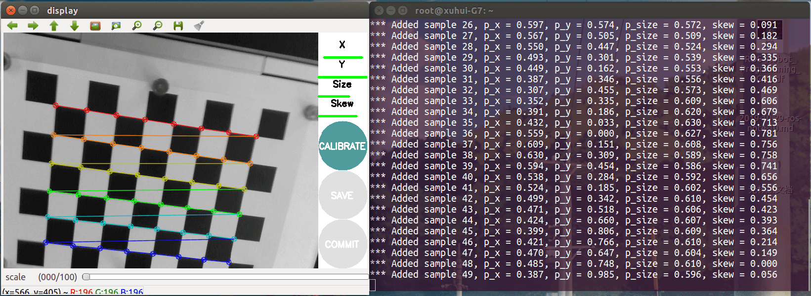
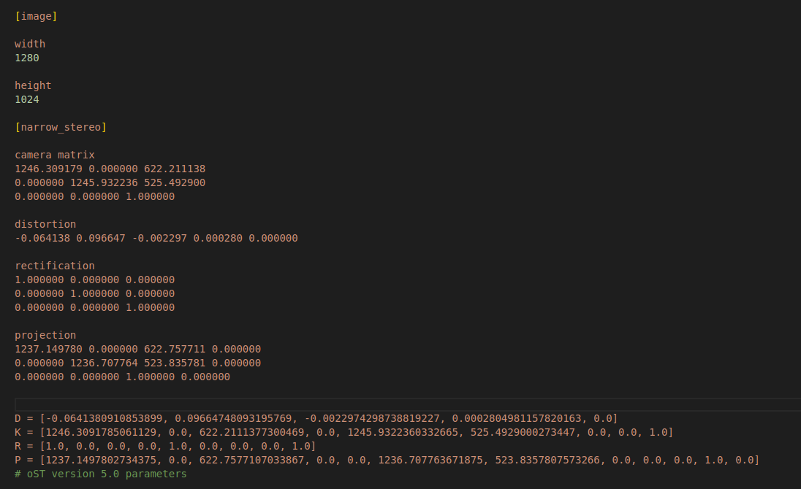
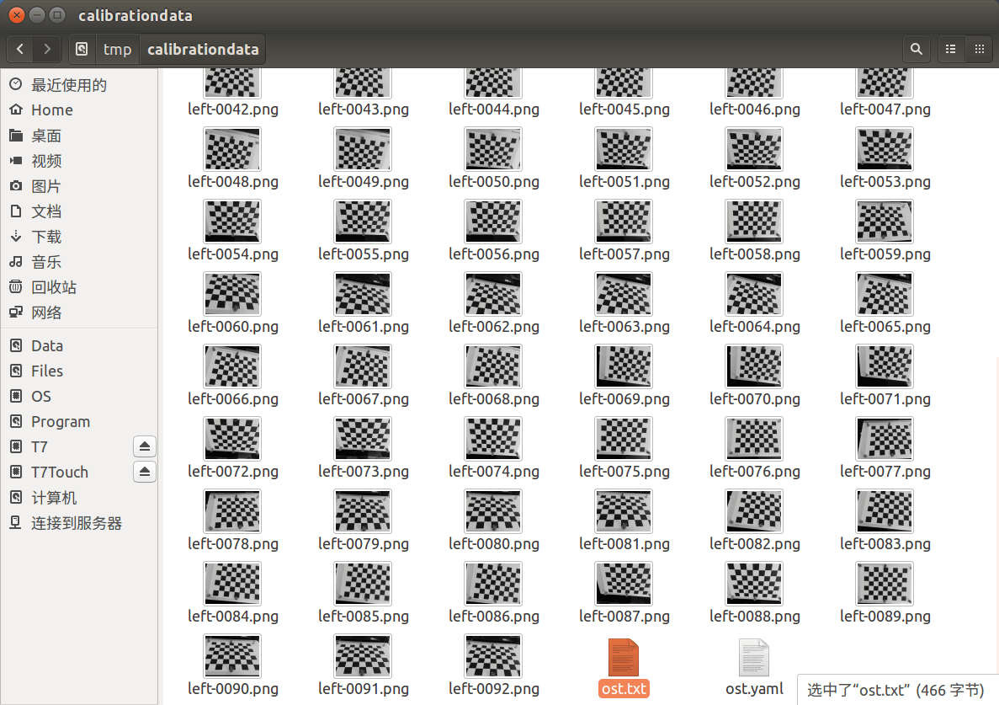
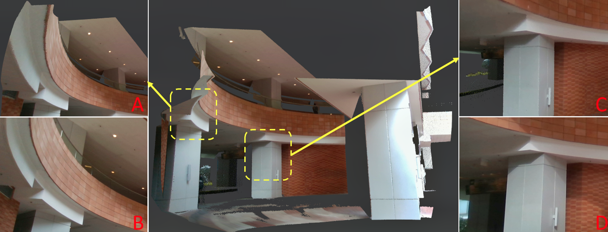
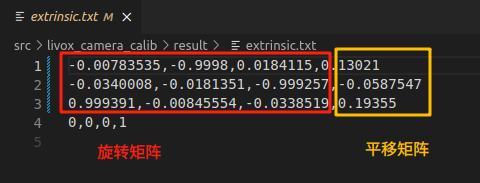

# FAST-LIVO2

## FAST-LIVO2: 快速和紧密耦合稀疏-直接 LiDAR-惯性-可视里程计

## 1. 环境配置

### 1.1 Ubuntu and ROS

Ubuntu 20.04.  [ROS Installation](http://wiki.ros.org/ROS/Installation).

### 1.2 PCL && Eigen && OpenCV

PCL>=1.6, Follow [PCL Installation](https://pointclouds.org/). 

```bash
sudo apt install libpcl-dev
```
Eigen>=3.3.4, Follow [Eigen Installation](https://eigen.tuxfamily.org/index.php?title=Main_Page).

```bash
sudo apt install libeigen3-dev
```

OpenCV>=3.2, Follow [Opencv Installation](http://opencv.org/).

### 1.3 Sophus

```bash
git clone https://github.com/strasdat/Sophus.git
cd Sophus
git checkout a621ff
mkdir build && cd build && cmake ..
make
sudo make install
```

上述步骤可能会报错,解决方案

```bash
/home/sun/Sophus/sophus/so2.cpp:32:26: error: lvalue required as left operand of assignment
   unit_complex_.real() = 1.;
                          ^~
/home/sun/Sophus/sophus/so2.cpp:33:26: error: lvalue required as left operand of assignment
```

打开其位置so2.cpp:32:26改为

```bash
SO2::SO2()
{
  unit_complex_.real(1.);
  unit_complex_.imag(0.);
}
```

### 1.4 Livox SDK2

```bash
git clone https://github.com/Livox-SDK/Livox-SDK2.git
cd ./Livox-SDK2/
mkdir build
cd build
cmake .. && make -j
sudo make install
```

## 2. 构建

### 2.1 livox_ros_driver2

将CMakeLists.txt中的ROS2部分删除，避免编译出错

```bash
git clone https://github.com/Livox-SDK/livox_ros_driver2.git ws_livox/src/livox_ros_driver2
cd ws_livox/src/livox_ros_driver2
source /opt/ros/noetic/setup.sh
./build.sh ROS1
```

### 2.2 Vikit

```bash
# Different from the one used in fast-livo1
cd ws_livox/src
git clone https://github.com/xuankuzcr/rpg_vikit.git 
```

### 2.3 FAST-LIVO2

```bash
cd ~/ws_livox/src
git clone https://github.com/hku-mars/FAST-LIVO2
cd ../
catkin_make
source devel/setup.bash
```

将FAST-LIVO2中有关livox_ros_driver报错的部分，将livox_ros_driver改为livox_ros_driver2

报错:包含在 /home/Fast_LIVO2_ws/src/FAST-LIVO2/src/IMU_Processing.cpp：13 的文件中：
/home/Fast_LIVO2_ws/src/FAST-LIVO2/include/IMU_Processing.h：52：12： 错误：字段 'fout_imu' 的类型不完整 'std：：ofstream' {又名 'std：：basic_ofstream'}

解决：在IMU_Processing.h里include一个fstream的头文件，重新catkin_make就可以了  #include <fstream.h>

## 3. 运行

### 3.1 运行rosbag文件

通过 OneDrive （FAST-LIVO-Datasets） 下载收集的 rosbag 文件，其中包含 4 个 rosbag 文件。([**FAST-LIVO2-Dataset**](https://connecthkuhk-my.sharepoint.com/:f:/g/personal/zhengcr_connect_hku_hk/ErdFNQtjMxZOorYKDTtK4ugBkogXfq1OfDm90GECouuIQA?e=KngY9Z)). 

```bash
roslaunch fast_livo mapping_avia.launch
rosbag play YOUR_DOWNLOADED.bag
```

### 3.2 运行海相机和mid360(海康相机配置在后面)

```bash
roslaunch mvs_ros_driver mvs_camera_trigger.launch
roslaunch livox_ros_driver2 msg_MID360.launch
roslaunch fast_livo mapping_mid360.launch
```

## 4. NVIDIA Xavier NX安装支持CUDA加速的opencv4.6.0

### 4.1 卸载自带opencv4.2.0

```bash
sudo apt-get purge libopencv*
sudo apt-get purge python-numpy
sudo apt autoremove 
sudo apt-get update
```

### 4.2 安装依赖

```bash
sudo apt update
sudo apt install -y build-essential cmake git libgtk2.0-dev pkg-config libavcodec-dev libavformat-dev libswscale-dev python3-dev python3-numpy libtbb2 libtbb-dev libjpeg-dev libpng-dev libtiff-dev libdc1394-22-dev libv4l-dev v4l-utils libopenblas-dev liblapack-dev libxvidcore-dev libx264-dev libgtk-3-dev libatlas-base-dev gfortran libhdf5-dev protobuf-compiler libgoogle-glog-dev libgflags-dev

```

### 4.3 安装opencv4.6

下载 opencv 源码，选择所需要的版本 opencv 4.6.0，相应的扩展 opencv_contrib 4.6.0，以及用于桥接 ROS 和 opencv 的 cv_bridge

https://github.com/opencv/opencv/releases/tag/4.6.0
https://github.com/opencv/opencv_contrib/releases/tag/4.6.0
https://github.com/ros-perception/vision_opencv/tree/noetic

解压后将opencv_contrib 4.6.0放入opencv 4.6.0文件夹中

```bash
cd ~/opencv-4.6.0/
mkdir build && cd build

cmake -D CMAKE_BUILD_TYPE=RELEASE \
      -D CMAKE_INSTALL_PREFIX=/usr/local \
      -D OPENCV_EXTRA_MODULES_PATH=../../opencv_contrib-4.6.0/modules \
      -D WITH_CUDA=ON \
      -D CUDA_ARCH_BIN=7.2 \
      -D CUDA_ARCH_PTX=7.2 \
      -D ENABLE_FAST_MATH=ON \
      -D CUDA_FAST_MATH=ON \
      -D WITH_CUBLAS=ON \
      -D WITH_LIBV4L=ON \
      -D WITH_GSTREAMER=ON \
      -D WITH_GSTREAMER_0_10=OFF \
      -D WITH_QT=OFF \
      -D WITH_OPENGL=ON \
      -D CUDA_NVCC_FLAGS="--expt-relaxed-constexpr" \
      -D WITH_TBB=ON \
      -D BUILD_TESTS=OFF \
      -D BUILD_PERF_TESTS=OFF \
      -D BUILD_EXAMPLES=OFF \
      ..

make -j$(nproc)  # 自动使用所有 CPU 核心
sudo make install

```

CMAKE_INSTALL_PREFIX=/usr/local/ 为安装地址，

OPENCV_EXTRA_MODULES_PATH=../../opencv_contrib-4.6.0/modules 为扩展模块所在路径，

CUDA_ARCH_BIN=7.2 为 GPU 算力

### 4.4 pkg-config --modversion opencv4依旧显示4.2的问题

删除opencv4.2.0残留文件
检查 OpenCV 冲突的 Bash 脚本 check_opencv_conflict.sh

```bash
chmod +x check_opencv_conflict.sh
./check_opencv_conflict.sh
```

安全删除系统中所有 OpenCV 旧版本（如 4.2）库和 .pc 文件，仅保留 OpenCV 4.6 的 Bash 脚本 remove_old_opencv.sh

```bash
chmod +x remove_old_opencv.sh
./remove_old_opencv.sh
```

一键清理并重新构建 cv_bridge 以链接 OpenCV 4.6 的脚本 rebuild_cv_bridge.sh

```bash
chmod +x rebuild_cv_bridge.sh
./rebuild_cv_bridge.sh
```

手动替换 opencv4.pc 为 4.6 的版本

第一步：确认 OpenCV 4.6 的安装路径

```bash
/usr/local/lib/pkgconfig/opencv4.pc
```

第二步：删除旧 .pc 文件

```bash
sudo rm -f /usr/lib/pkgconfig/opencv4.pc
sudo rm -f /usr/share/pkgconfig/opencv4.pc
```

第三步：为 OpenCV 4.6 手动生成 opencv4.pc 文件

给chatgpt提供

```bash
ls /usr/local/lib | grep opencv
ls /usr/local/include/opencv4
```
生成更精确的 opencv4.pc

我就能帮你自动生成更精确的 opencv4.pc

```bash
sudo tee /usr/local/lib/pkgconfig/opencv4.pc > /dev/null <<EOF
prefix=/usr/local
exec_prefix=\${prefix}
libdir=\${exec_prefix}/lib
includedir=\${prefix}/include/opencv4

Name: OpenCV
Description: Open Source Computer Vision Library
Version: 4.6.0
Libs: -L\${libdir} \
  -lopencv_core -lopencv_imgproc -lopencv_highgui -lopencv_imgcodecs -lopencv_videoio \
  -lopencv_calib3d -lopencv_features2d -lopencv_flann -lopencv_ml -lopencv_objdetect \
  -lopencv_photo -lopencv_shape -lopencv_stitching -lopencv_superres -lopencv_video \
  -lopencv_videostab -lopencv_xfeatures2d -lopencv_ximgproc -lopencv_xphoto \
  -lopencv_dnn -lopencv_dnn_objdetect -lopencv_dpm -lopencv_face -lopencv_text \
  -lopencv_tracking -lopencv_phase_unwrapping -lopencv_saliency -lopencv_bgsegm \
  -lopencv_bioinspired -lopencv_ccalib -lopencv_datasets -lopencv_freetype \
  -lopencv_hdf -lopencv_line_descriptor -lopencv_mcc -lopencv_quality -lopencv_rapid \
  -lopencv_reg -lopencv_rgbd -lopencv_surface_matching -lopencv_wechat_qrcode \
  -lopencv_alphamat -lopencv_aruco \
  -lopencv_cudaarithm -lopencv_cudabgsegm -lopencv_cudacodec -lopencv_cudafeatures2d \
  -lopencv_cudafilters -lopencv_cudaimgproc -lopencv_cudalegacy -lopencv_cudaobjdetect \
  -lopencv_cudaoptflow -lopencv_cudastereo -lopencv_cudawarping -lopencv_cudev
Cflags: -I\${includedir}
EOF
```

第四步：导出PKG_CONFIG_PATH

```bash
echo 'export PKG_CONFIG_PATH=/usr/local/lib/pkgconfig' >> ~/.bashrc
source ~/.bashrc
```

第五步：验证

```bash
pkg-config --modversion opencv4

```

## 5. Github教程

### 5.1 在命令行上创建新存储库

```bash
git init
git add README.md
git commit -m "Fast_Livo2"
git branch -M main
git remote add origin https://github.com/Jian2032/Fast_Livo2.git
git push -u origin main
```

### 5.2 从命令行推送现有存储库

```bash
git remote add origin https://github.com/Jian2032/Fast_Livo2.git
git branch -M main
git push -u origin main
```

## 6. 相机标定 Camera Calibration

本文采用**Camera Calibration来进行相机内采纳标定，详细环节参考[此文章](https://zhaoxuhui.top/blog/2021/02/02/ros-camera-calibration.html)**

1.安装标定功能包

```bash
sudo apt install ros-$ROS_DISTRO-camera-calibration
```

2.准备棋盘格
本文采用淘宝购买的成品棋盘格标定板
也可打印棋盘格：可直接下载此文件并打印（原尺寸居中）出来（打印棋盘格的尺寸精度与打印机有关）


3.启动标定程序
a.在相机驱动文件夹下，启动终端，打开相机节点：

```bash
source ./devel/setup.sh
roslaunch mvs_ros_pkg mvs_camera_trigger.launch
```

b.新建终端，打开标定节点：

```bash
rosrun camera_calibration cameracalibrator.py --size 17x17 --square 0.2 image/image:=/left_camera/image
```

cameracalibrator.py标定程序需要以下几个输入参数。

| 参数 | 说明 |
|------|------|
| `rosrun camera_calibration cameracalibrator.py` | 启动相机标定节点。该节点会弹出 GUI 来辅助你完成相机标定过程。   
| `--size 8x6` | 棋盘格的**内角点数量**，表示横向 8 个角点、纵向 6 个角点（注意：是交点数，不是方块数）。 |
| `--square 0.028` | 棋盘格中每个方格的实际边长，单位为米（此处为 2.8 厘米）。 |
| `image:=/left_camera/image` | 指定输入图像的 ROS 话题名，从该话题中读取图像数据进行标定。 |

根据使用的摄像头和标定靶棋盘格尺寸，相应修改以上参数，即可启动标定程序。
c.按照提示移动


在没有标定成功前，右边的按钮都为灰色，不能点击。为了提高标定的准确性，应该尽量让标定靶出现在摄像头视野范围内的各个区域，界面右上角的进度条会提示标定进度。

1）X：标定靶在摄像头视野中的左右移动。
2）Y：标定靶在摄像头视野中的上下移动。
3）Size：标定靶在摄像头视野中的前后移动。
4）Skew：标定靶在摄像头视野中的倾斜转动。

不断在视野中移动标定靶，直到“CALIBRATE”按钮变色，表示标定程序的参数采集完成。点击“CALIBRATE”按钮，标定程序开始自动计算摄像头的标定参数，这个过程需要等待一段时间，界面可能会变成灰色无响应状态，注意千万不要关闭。

参数计算完成后界面恢复，而且在终端中会有标定结果的显示。


d.结果保存

击”SAVE”按钮，稍微等待几秒，即可保存标定好的结果。标定结果默认保存在/tmp/calibrationdata.tar.gz，手动拷贝出来即可。内容包含参数文件和标定用到的影像，如下图所示。


## 7. 雷达相机联合标定 livox_camera_calib

本文采用无目标来联合标定 [livox_camera_calib](https://gitee.com/link?target=https%3A%2F%2Fgithub.com%2Fhku-mars%2Flivox_camera_calib%2Ftree%2Fmaster)

litar_camera_calib是无目标环境中高分辨率 LiDAR（例如 Livox）和相机之间的强大、高精度外部校准工具。我们的算法可以在室内和室外场景中运行，并且只需要场景中的边缘信息。如果场景合适，我们可以达到类似于甚至超越基于目标的方法的像素级精度。


对场景有一定要求（沦落清晰的边角线+光线对比明显），操作上要求较高

依据官方说明安装依赖环境，然后编译程序 [livox_camera_calib](https://gitee.com/link?target=https%3A%2F%2Fgithub.com%2Fhku-mars%2Flivox_camera_calib%2Ftree%2Fmaster)

```bash
cd ~/catkin_ws/src
git clone https://github.com/hku-mars/livox_camera_calib.git
cd ../
catkin_make
source ~/catkin_ws/devel/setup.bash
```

### a.选好场景，启动雷达、相机，保持静止，录制10S点云和图像话题(时间尽量长一些不然报错)

启动雷达

```bash
roslaunch livox_ros_driver2 msg_MID360.launch
```

启动相机

```bash
roslaunch mvs_ros_pkg mvs_camera_trigger.launch
```

录制bag文件

```bash
rosbag record /livox/lidar /livox/imu /left_camera/image
```

### b.从bag中提取图片、pcd

#### 1.提取图片，这里参考[CSDN文档](https://blog.csdn.net/ouyangandy/article/details/100116552)中的第一中方法

ROS-从rosbag中提取图像（by launch文件）

1.新建launch文件（文件在哪无所谓，可以在catkin_ws的根目录） : bag2img.launch

```bash
<launch>
  <node pkg="rosbag" type="play" name="rosbag" args="-d 2 /home/sun/Camera-IMU-LiDAR/bag/test/test.bag" />

  <node name="extract" pkg="image_view" type="extract_images" output="screen">
    <remap from="image" to="left_camera/image"/>
    <param name="sec_per_frame" value="0.03"/>
    <!-- 下面三行用于保存图像（可选） -->
    <param name="save_all_image" value="true"/> 
    <param name="image_transport" value="raw"/>
    <param name="filename_format" value="/home/sun/Camera-IMU-LiDAR/bag/test/image/%i.jpg"/>
  </node>
</launch>
```

note:
`/home/sun/Camera-IMU-LiDAR/bag/test/test.bag` 为你录制的bag文件的绝对路径，`left_camera/image`为你提取的topic的名字，你可以使用：

rosbag info file_name.bag

查看你需要提取的图片的topic名字。< param name="sec_per_frame" value="0.03"/>这句话是说，以每一帧花费0.03s的时间，这个条件对你的bag文件进行图像提取，如果没有这句话，就是默认0.1s，也就是没秒10帧的速率对图像提取。经过我的测试发现，无论怎么调整这个值，都无法跟bag文件中的信息数目匹配，因此来说，这种方法存在一定的图像缺失的情况，只能无限接近袁原始图像的数目，比如我的原始数据有640帧，但经过调整sec_per_frame的值，最高的时候还是只能到639，多数情况下到637，默认值0.1的时候，只有200多张图像。
2.运行launch

```bash
roslaunch livox_camera_calib bag2img.launch
```

默认情况下提取成功的图像存储在你home文件夹下的.ros文件夹下，一般是隐藏的文件夹，使用crtl+h可显示出来。
`<param name="filename_format" value="/home/sun/Camera-IMU-LiDAR/bag/test/image/%i.jpg"/>`可将图片保存在自己文件夹。

优点：操作简单，使用ros即可；缺点：提取信息与原始录制的信息并不完全一致，主要体现在提取的图片数量和ros录制的时候的信息数量不一致，会少。此外，不含有时间戳；

#### 2.提取点云转为pcd

这里可直接调用[livox_camera_calib](https://gitee.com/link?target=https%3A%2F%2Fgithub.com%2Fhku-mars%2Flivox_camera_calib%2Ftree%2Fmaster)中的bag_to_pcd.launch文件

```bash
<launch>
  <node 
    pkg="livox_camera_calib"
    type="bag_to_pcd"
    name="bag_to_pcd"
    output="screen"
  />
   <param name="bag_file" type="string" value="/home/sun/Camera-IMU-LiDAR/bag/test/test.bag"/>
   <param name="lidar_topic" type="string" value="/livox/lidar"/>
   <param name="pcd_file" type="string" value="/home/sun/Camera-IMU-LiDAR/bag/test/pcd/0.pcd"/>
   <param name="is_custom_msg" type="bool" value="true"/>
</launch>
```

如果使用的是自定义雷达消息类型`is_custom_msg`改为true，否则为false

```bash
roslaunch livox_camera_calib bag_to_pcd.launch
```

### c.启动程序进行联合标定

将提取出的图片和PCD文件放入程序指定目录，即可启动程序标定

```bash
roslaunch livox_camera_calib calib.launch
```

该最终结果会是一个extrinsic.txt的文件：
结果是个4*4的齐次变换矩阵


## 8. 雷达和imu联合标定 lidar_imu_init

## 9. 海康相机配置

相机型号：MV-CU013-A0UC

下载v2.1.2版本MVS客户端：https://www.hikrobotics.com/cn2/source/support/software/MVS_STD_GML_V2.1.2_221208.zip

下载相机功能包：
```bash
git clone https://github.com/xuankuzcr/LIV_handhold.git
```

修改配置文件left_camera_trigger.yaml
```bash
%YAML:1.0

#--------------------------------------------------------------------------------------------
# Camera Parameters. Adjust them!
#--------------------------------------------------------------------------------------------
SerialNumber: "DA5464641" # Not needed for single camera. Specify serial number for multiple cameras. 
TopicName: "left_camera/image"

TriggerEnable: 1 # 0 stands for Off, 1 stands for On

ExposureAutoMode: 0 # 0 stands for Off, 1 stands for Once, 2 stands for Continues
ExposureTime: 5000 # us

image_scale: 0.5 # 1 0.5
GainAuto: 2 # Gain Auto, 0 stands for Off, 1 stands for Once, 2 stands for Continues
Gain: 15 # min: 0   max: 17.0166
Gamma: 0.7  # min: 0   max: 17.0166
GammaSelector: 1 # 0 stands for user, 1 stands for sRGB

PixelFormat: 3 # 0: RGB8, 1: BayerRG8, 2: BayerRG12Packed, 3: BayerGB12Packed, 4: BayerGB8
```

PixelFormat改为3